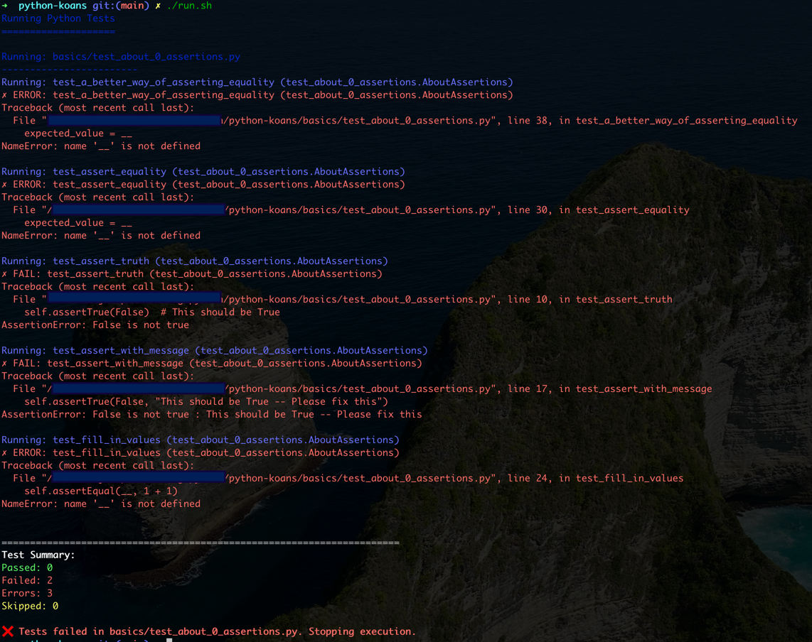

# Python Koans Learning Path

## What are Python Koans?
Python Koans is an interactive learning path inspired by the Ruby Koans. 
The word "koan" comes from Zen Buddhism and refers to riddles or puzzles used to help practitioners reach enlightenment.
In programming, koans are small lessons that teach language syntax and structure through the process of fixing failing tests.

## Getting Started

### Prerequisites
- Python 3.6 or higher
- Unittest module (comes with Python)
- NumPy and Pandas (for advanced koans)

### Installation
1. Clone or download this repository

```commandline
  git clone git@github.com:sujithps/python-koans.git
```

2. Install required packages:
```bash
pip install numpy pandas
```

### Running the Tests

#### For Windows Users:
Double-click `run.bat` or run from command prompt:
```batch
run.bat
```

#### For Unix/Linux/Mac Users:
Make the script executable and run:
```bash
chmod +x run.sh
./run.sh
```

### Sample run


## Understanding the Test Structure

### Test Organization
Tests are organized in ascending order of complexity:
```
basics/
    ├── test_about_0_assertions.py      # Basic assertions
    ├── test_about_1_strings.py         # String operations
    ├── test_about_2_lists.py           # List operations
    ├── test_about_3_dictionaries.py    # Dictionary operations
    ├── test_about_4_numbers.py         # Number operations
    ├── test_about_5_control_flow.py    # Control flow
    ├── test_about_6_functions.py       # Functions
    ├── test_about_7_comprehensions.py  # List comprehensions
    ├── test_about_8_numpy.py           # NumPy basics
    └── test_about_9_pandas.py          # Pandas basics
```

### How Koans Work
1. Each test file contains test cases with missing pieces (marked with `__`)
2. Your task is to replace `__` with the correct value
3. Tests run in order and stop at the first failure
4. Fix each test and move on to the next one

## Fixing Test Cases

### Example Test Case:
```python
def test_assert_truth(self):
    """We shall contemplate truth by testing reality, via asserts."""
    self.assertTrue(__)  # Fix this
```

### How to Fix:
1. Run the tests
2. Read the error message
3. Replace `__` with the correct value:
```python
def test_assert_truth(self):
    """We shall contemplate truth by testing reality, via asserts."""
    self.assertTrue(True)  # Fixed!
```

## Common Patterns in Test Cases

### Assertion Types
- `assertEqual(__, value)` - Replace `__` with matching value
- `assertTrue(__)` - Replace `__` with something that's True
- `assertIsInstance(__, type)` - Replace `__` with correct type

### Value Types
- Numbers: `42`, `3.14`
- Strings: `"hello"`, `'world'`
- Lists: `[1, 2, 3]`
- Dictionaries: `{'key': 'value'}`
- Boolean: `True`, `False`

## Troubleshooting

### Common Issues and Solutions

1. **ModuleNotFoundError**
   ```
   Error: No module named 'numpy'
   ```
   Solution: Install required package
   ```bash
   pip install numpy
   ```

2. **Permission Denied (Unix/Linux)**
   ```
   bash: ./run.sh: Permission denied
   ```
   Solution: Make script executable
   ```bash
   chmod +x run.sh
   ```

3. **Python Command Not Found**
   ```
   'python' is not recognized...
   ```
   Solution: Add Python to PATH or use full path
   ```batch
   set PATH=%PATH%;C:\Python39
   ```

4. **Test Discovery Fails**
   ```
   No tests found
   ```
   Solution: Ensure you're in the correct directory and files start with "test_"

### Debug Tips
1. Print values to understand what's happening:
   ```python
   value = some_calculation()
   print(f"Value is: {value}")
   ```

2. Use Python's interactive mode to experiment:
   ```python
   python
   >>> # Try your code here
   ```

## Things to Remember

### Best Practices
1. **Read Error Messages Carefully**
   - Error messages tell you what's wrong
   - They show the expected vs actual value
   - They point to the line number to fix

2. **One Test at a Time**
   - Fix tests in order
   - Don't skip ahead
   - Each test builds on previous concepts

3. **Understanding > Memorizing**
   - Try to understand why each solution works
   - Experiment with different values
   - Think about edge cases

### Taking Notes
Keep track of:
- New concepts you learn
- Patterns you discover
- Tricky problems and their solutions

## Tips for Success

1. **Don't Peek at Solutions**
   - Try to solve each koan yourself
   - Use Python documentation
   - Experiment in interactive mode

2. **Use Python Documentation**
   - [Python Official Docs](https://docs.python.org/3/)
   - [NumPy Documentation](https://numpy.org/doc/)
   - [Pandas Documentation](https://pandas.pydata.org/docs/)

3. **Take Breaks**
   - If stuck, take a short break
   - Return with fresh eyes
   - Sometimes solutions come when you step away

## Getting Help
If you're stuck:
1. Read the test file's docstrings
2. Check Python's documentation
3. Use `print()` to understand values
4. Search for similar problems online
5. Ask in Python communities

Remember: The journey is as important as the destination. Take your time to understand each concept thoroughly.